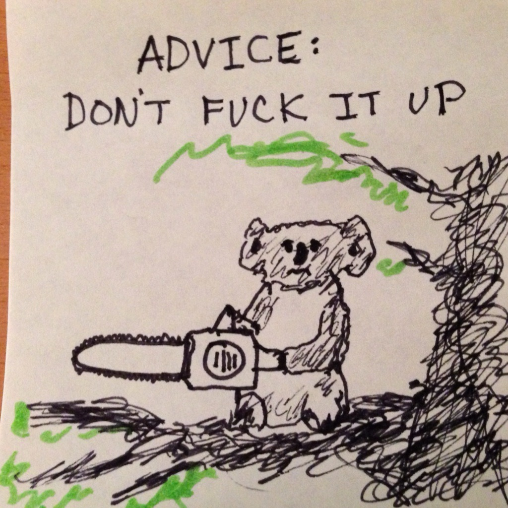

Years ago, I was head of platform and principal engineer at a company. Engineers, often junior ones, would come to my desk with a very expectant look. They'd tell me, in great detail, about a change they were looking to make. They'd clearly put a lot of thought and research into it. When they finally finished, they'd look at me for approval.

I'd tell them:

> It seems like you've done a lot of research on this and given it a lot of thought. You clearly know a lot more about this than I do. If you want, we can go through some of the details for correctness. Otherwise, don't fuck it up.

It became a bit of a motto for my team. Any time we were about to do something tricky, any time we were about to do something risky — planned, but risky — somebody would say it.

I sent this post to one of my old teammates today and asked them why they thought it spread. Here's what they said:

> I think the spread was mostly that other people who were also seen as experts saw the value in saying "you sound like you have a good handle on this, just don't hurt yourself or others." We didn't always feel obligated to throw in an opinion just to feel important.

