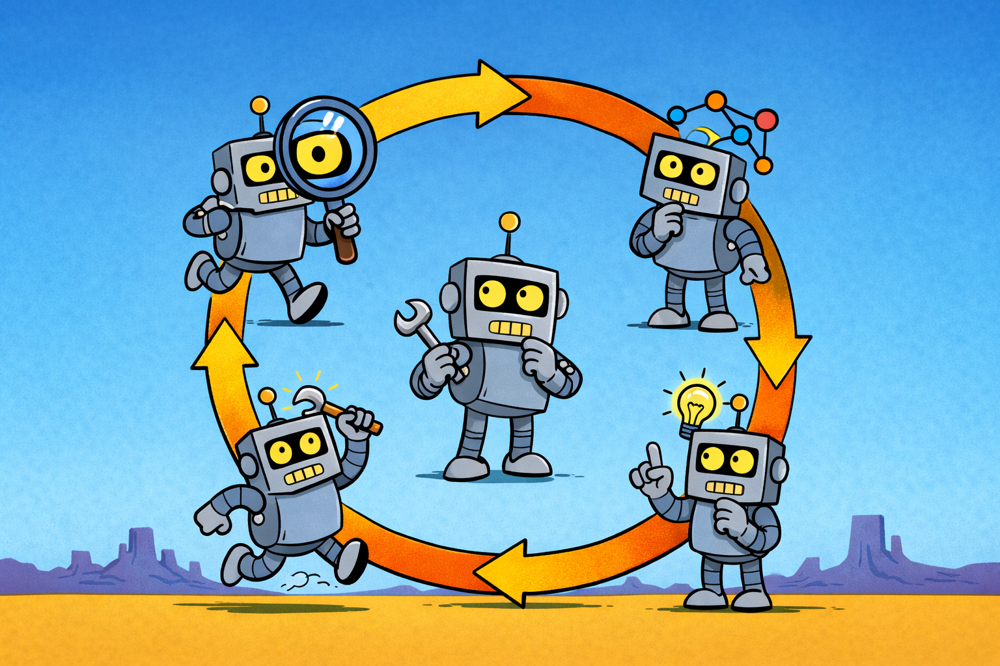

Anyone who has worked with me knows that I have a few things that are touchstones that come up often. "Water is wet", "Go slow to go fast", "Don't fuck it up", "Baby steps", and [the OODA loop](https://en.wikipedia.org/wiki/OODA_loop) amongst them. Knowing me and my uncontrollable desire to talk about the things that are important to me, I will end up writing blog posts about all of those topics (and more!). Today's though is the OODA loop.

## The loop

Observe, Orient, Decide, Act. Col. John Boyd built the framework out of his experience as a fighter pilot. The pilot who can observe, orient, decide, and act faster than the other pilot wins the dogfight. Not because he makes better moves, but because by the time the other guy commits to a move, the world has already changed under him. The loop, run fast and run continuously, beats a plan that commits early.

You might be reading that and thinking "isn't that just iteration?" Yes. It's a common criticism. For me, the value isn't that OODA is novel. The value is having a short, sticky name for a specific idea: you keep looping. Observe, orient, decide, act, observe again. Step through it once and you haven't used it. The word "loop" is pulling the real weight.

## How LLMs get stuck

LLMs are bad at loops. They get locked into "a plan". Spec-driven development looks like waterfall to a lot of people because a lot of people run it like waterfall. Plan everything ahead of time, hand the plan to the model, and the model marches from step 1 to step N. It'll make small adjustments along the way, but come hell or high water, it's going to find a way from 1 to N. That is a recipe for crap. A recipe for AI slop.

I try to build iteration into everything I do with an LLM. It's harder than it sounds. We naturally frame things for an LLM as "do A, then B, then C." That's the happy path. If everything goes the way we expect, that's what will happen. But [things don't always go the way we expect](https://www.youtube.com/watch?v=5W4NFcamRhM).

The failure mode I keep running into: the model hits something that should trigger "pause and reconsider", and instead it pushes forward. It's working on its third build error in a row, and each fix is making the next fix harder, and what it should have done four errors ago was stop and ask whether the approach itself was wrong. It didn't, because nothing in its instructions told it to. The model isn't dumb. It was told to do exactly what it did.

## The pivot I didn't see coming

When I started paying attention to where these failures came from, they weren't coming from the model. They were coming from my instructions. I'd written sentences that look fine line by line. Put them together and they told the model to drive in a straight line through errors it should have been using as evidence the plan was wrong.

A quick word on what I mean by "my instructions", for anyone not using Claude Code. The model reads two kinds of text files at the start of a session. `CLAUDE.md` files hold standing directions — one global, one per project. Skills are named blocks of instructions Claude loads on demand, each a procedure manual for a specific kind of work. I write and maintain both. Those are the files the audit reads.

Here's a real one, from a skill I have for upgrading LLVM in the Pony compiler:

> If the build finds additional errors, fix and amend the commit.

Reasonable-looking instruction. You'd say the same thing to a junior engineer. But it's a pipeline. There's no moment to ask *why* the errors are showing up. Same class of API change as what I already fixed — another call site that needs the same rename? Fix forward. Different class — say, a return type changed, or a function got split into two? Then the migration pattern itself was wrong, and every forward fix buries the problem deeper. The instruction collapses those two cases into one response. It prescribes action without orientation.

That line, sitting inside a multi-step upgrade workflow, is the LLM version of the dogfight where the other pilot committed early. No re-observation. No re-orientation. Just execute.

## The audit

So I built a skill. It's called [ooda-audit](https://github.com/SeanTAllen/claude/blob/3ca7a717d70b9acabce9773f8483275ccc63672d/skills/ooda-audit/SKILL.md), and it has exactly one job: read my global `CLAUDE.md`, the project `CLAUDE.md` for whatever I'm working in, and every skill file I've got installed, and flag any instruction that discourages continuous observation, orientation, and re-evaluation.

It's narrow on purpose. It doesn't flag heavy instructions. It doesn't flag instructions I'd word differently. It doesn't flag anything except pipeline thinking. The categories it looks for are short: instructions that encourage blind execution, instructions that treat phases as one-way gates, instructions that prescribe an action without leaving space to orient, language that suppresses re-evaluation, workflows that skip observation points between significant actions. That's most of the list.

I run it manually. After a session where Claude charged forward on something that needed a pause. After a big instruction rewrite, when I want to see what I baked in. It returns findings with a scenario attached to each one, and then I decide what to change. The skill doesn't get to edit anything. That's by design too. An audit that writes the fix is an audit that hides its reasoning.

## What a fix looks like

The LLVM instruction was one of the first findings. Here's the before and after.

Before:

> If the build finds additional errors, fix and amend the commit.

After:

> If the build finds additional errors, assess whether they're the same class of API change already handled (fix and amend) or indicate a different migration pattern is needed (go back and choose a new migration pattern).

One sentence changed. The shape of the change is the point. The old version had a single response for one observed condition. The new version asks the model to orient before responding, names the two cases, and tells it where each case leads. Same-class errors get the old behavior. Different-class errors route back to an earlier step. The "observe" step didn't need to be long. It needed to exist.

That's what the audit keeps finding. Not bad instructions. Instructions that quietly collapsed an observe-orient step into a prescribed action. The fix is almost always the same shape: spread that step back out, ask "what kind of thing am I looking at?" before answering "what do I do about it?"

## Bad meaning bad

The part that throws most people when I describe the failure mode is that the bad instructions don't look bad. "Fix and amend" is exactly what you'd say to a person. The problem isn't that the instruction is wrong. The problem is that an LLM follows instructions more literally than a person does, and the model doesn't have the ambient judgment a human engineer has that says "three errors in, it's time to pull back and ask someone." A person reading "fix and amend" still has the orient step. They just don't say it out loud, because they know it's implicit. The LLM doesn't know it's implicit. If you didn't write it down, it didn't happen.

So you write it down. That's the whole skill.

## Closing

Turning OODA into a lens for my own instructions has been one of the higher-leverage small things I've done with Claude Code. The audit takes very little time to run. The fixes are usually a sentence. What it catches is the quiet stuff: instructions that looked fine and were actively teaching the model not to look up.

If you write instructions for an LLM, here's the shape to scan for. Every "when X, do Y" is a spot where you've decided what X is before the model gets to look. Make sure the model has somewhere to notice when X turns out to be something else.
