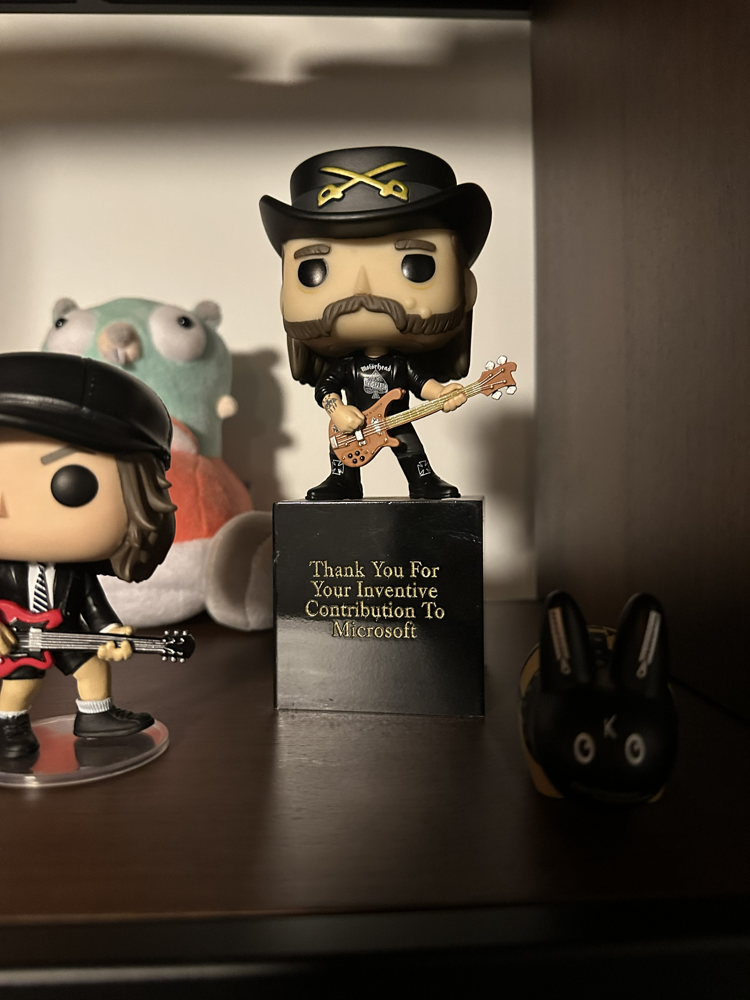

My name is Sean T. Allen. Back in my salad days, I worked at Microsoft Research. I was part of the Confidential Computing group, working on a project called Parma. It was some of the most interesting work I've ever done. Then Satya needed to free up some cash for [Sam Altman](https://www.youtube.com/watch?v=Wh3t49NsWBA), and suddenly I was exploring new opportunities.

But before my involuntary career pivot, we shipped something I'm genuinely proud of: Parma. It's the technology behind [Confidential Containers on Azure Container Instances](https://learn.microsoft.com/en-us/azure/container-instances/container-instances-confidential-overview). It was considered important enough to make it into [Satya's keynote at Build](https://www.youtube.com/watch?v=Un8MzEwW0sY). And we published a [paper](https://dl.acm.org/doi/10.1145/3664293) about it at ASPLOS 2024.

The paper is good. It's also an academic paper, which means it's written for people who already know what a Trusted Computing Base is and have opinions about the relative merits of process-based versus VM-based TEEs. Most people aren't those people. So I want to take the core ideas behind Parma and make them accessible. Walk you through it from the ground up. No assumed knowledge about confidential computing. Just the ideas, the threat model, and the mechanisms, explained the way I'd explain them if we were sitting at a bar and you asked me what I'd been working on.

Before we can talk about Parma itself, we need to build up some vocabulary. I'm going to walk you through a handful of concepts, one at a time. They'll snap together at the end. And if I do my job right, by the end of this, you'll understand what a "TEE" is.

## What's a Threat Model?

A threat model is how you answer the question: "What am I afraid of?"

Not in the existential sense. In the engineering sense. You sit down and figure out: who might attack my system, what can they do, and what am I trying to protect? You draw a line around the stuff you're defending and figure out where the danger comes from.

Without a threat model, security work is just vibes. "We should encrypt that." Why? Against what attack? "It's best practice." Cool. What threat does it address? Without answers to those questions, you're just sprinkling magic security dust and hoping it works. A threat model forces you to be honest about what you're actually defending against, so you can reason about whether your defenses make any sense.

## Trust Is the Problem

Here's the part that trips people up. In security, trust isn't good. It's a liability.

When you say "I trust X," what you're really saying is "X can hurt me." You're declaring that your security depends on X behaving correctly. If X is buggy, compromised, or outright malicious, your security guarantees go up in smoke.

Everything you trust is part of your Trusted Computing Base, or TCB. The TCB is the set of hardware and software and people that has to work correctly for your security to hold. If any piece of it is compromised, the whole thing falls apart. The game, then, is to make this set as small as possible. The less you trust, the less that can betray you.

Think about a normal cloud deployment. You deploy your application to a VM running on someone else's hardware. Your TCB includes the cloud provider's hypervisor, their host operating system, their management software, their storage infrastructure, all of their human operators with access to all those systems. That's a lot of components. A lot of code. A lot of people with access. Every single one of them is something that can hurt you if it goes wrong. Your security depends on all of it being correct and honest, all the time.

In 2019, the US Department of Justice charged two former Twitter employees with [spying on behalf of Saudi Arabia](https://en.wikipedia.org/wiki/Saudi_infiltration_of_Twitter). They used their insider access to look up private information on critics of the Saudi government. Twitter's users had to trust Twitter's employees. Those employees were in the TCB. And some of them were working for a foreign government. That's the problem with a big TCB. The more people and systems you trust, the more ways things can go sideways.

## What Is Attestation?

Before we go further, I need to explain attestation, because it's going to come up a lot. I mean, a lot. This blog post is basically, "no understand attestation, not understand the post". So...

Attestation is proof of identity. Not "I say I'm trustworthy" proof. Cryptographic, hardware-backed, mathematically verifiable proof.

Here's the analogy. You walk into a bar and someone claims to be a doctor. You can take their word for it. Or you can ask to see a medical license issued by a state board, with a verifiable license number, signed by an authority you can independently check. Attestation is the license, not the claim.

To understand how attestation works, you first need to understand what a cryptographic measurement is. A hash function takes an input of any size (a file, a disk image, a whole OS) and produces a fixed-size output, called a hash or digest. The critical properties: the same input always produces the same hash, and even a tiny change to the input produces a completely different hash. You can't reverse it (you can't reconstruct the input from the hash) and you can't fake it (you can't find a different input that produces the same hash). A cryptographic measurement is just the result of running a hash function over some data. It's a fingerprint. If the data changes, the fingerprint changes.

In the computing world, attestation works like this: when a system boots up, special hardware takes a cryptographic measurement of everything that gets loaded. The OS, the boot code, the configuration. It feeds all of it through a hash function, producing a fingerprint that uniquely identifies exactly what was loaded. Later, the hardware can produce a signed report that says: "This is the exact fingerprint of what's running, and I am a genuine piece of hardware made by [manufacturer], and here's a cryptographic signature you can verify against the manufacturer's root certificate to prove I'm not lying."

The critical property: the software running inside the system can't forge or alter the measurement. The hardware does the measuring. The hardware does the signing. If you trust the hardware manufacturer, you can trust the report.

## Hardware Root of Trust

Our goal in security is to make the TCB as small as possible. So, how do you shrink the TCB? You push trust down into hardware. Hardware is harder to compromise than software. You can't patch a CPU with a phishing email.

AMD makes server processors with a feature called SEV-SNP (Secure Encrypted Virtualization - Secure Nested Paging). The name is a mouthful, but what it does is straightforward. It creates a hardware-enforced boundary around a virtual machine that even the hypervisor can't cross. In security jargon, this is called a Trusted Execution Environment, or TEE. A TEE is just a hardware-isolated space where code can run and data can be processed without anything outside it being able to peek in or tamper.

SEV-SNP gives you three things. First, memory encryption. Every VM gets its own encryption key, managed by a dedicated security processor on the CPU called the Platform Security Processor (PSP). Data in RAM is encrypted. The key never leaves the CPU. Not the hypervisor, not the host OS, not a technician with physical access to the memory modules can read it.

But encryption alone isn't enough. An attacker who can't read your memory might still be able to mess with it. Replay old data into a page. Corrupt encrypted blocks. Remap the VM's memory so it sees an inconsistent view of its own state. So SEV-SNP also provides memory integrity, using a structure called the Reverse Map Table (RMP) that tracks which VM owns each page of physical memory. The CPU checks the RMP on every memory access. If something doesn't match, the access is blocked.

And finally, the piece that ties the whole system together: attestation. When the VM boots, the PSP takes a cryptographic measurement of everything loaded into it: the OS image, the boot code, the initial configuration. This measurement gets baked into a signed attestation report. The report is signed with a key that's derived from chip-unique secrets and rooted in AMD's certificate authority. Anyone can verify the report and confirm: this VM is running exactly this code, on a genuine AMD processor.

The CPU and the PSP are the root of trust. You're trusting AMD's silicon and firmware. That's it. The hypervisor, the host OS, the cloud provider's management stack, the cloud provider's employees: all outside the trust boundary.

## The Cloud Container Problem

Now let's talk about containers.

When you deploy a container to a cloud service like Azure Container Instances, a whole orchestration dance happens. The cloud platform pulls your container image from a registry, spins up a utility VM (UVM) to host it, mounts the image layers, sets environment variables, and starts your container. On the host side, a component called the "container shim" drives all of this by talking to a "guest agent" running inside the VM. The shim says "mount this image layer," and the guest agent does it. The shim says "start this container with these environment variables," and the guest agent does it.

Here's the problem. The host controls everything. It decides which container images get mounted. It sets the environment variables. It chooses which commands to run. Even if the VM is hardware-isolated with SEV-SNP so nobody can peek at its memory, the host is still the one telling the VM what to do. A compromised host could:

Swap in a malicious container image. Inject rogue environment variables. Mount container layers in the wrong order. Run arbitrary commands inside the VM. Or worse: start your legitimate containers, wait for them to acquire secrets, then load an attack container alongside them.

Hardware isolation protects the VM's memory. But it doesn't protect against someone feeding the VM poisoned instructions. It's like having an impenetrable vault with a guard inside who follows orders from anyone who walks up to the window.

## Parma's Threat Model

Parma assumes the worst. The adversary controls the entire host system: the hypervisor, the host OS, the container management software, the network. Everything outside the hardware-isolated VM is hostile territory.

"Adversary" doesn't mean Microsoft here. It means anyone with that level of access. A rogue employee. A nation-state actor who compromised the host. A hacker who found a privilege escalation exploit. The threat model doesn't care about who or why. It cares about capability. If someone has root on the host, they're the adversary regardless of how they got there or what flag they fly.

What Parma trusts: the CPU, the PSP, and the firmware running on the PSP. That's the TCB. That's all of it. Everything else is suspect.

## Execution Policies: The Key Idea

Here's Parma's central insight.

Hardware attestation tells you what the VM looked like at boot. It's a snapshot. But it says nothing about what happens after that. The host keeps sending commands to the guest agent, and any of those commands could be malicious. An attestation report from boot time is like a building inspector saying "the foundation was solid when we poured it." Helpful, but it doesn't tell you whether someone added a door to the vault afterward.

The naive fix would be to cut the host out entirely. Let the VM manage itself. But that kills the whole point of a container service. The reason you use something like Azure Container Instances is that the provider handles the orchestration: pulling images, managing resources, starting and stopping containers. Take that away and you've just got a regular VM you have to babysit yourself.

Parma threads the needle. The host still orchestrates. But the guest agent won't do anything the customer hasn't explicitly authorized.

The mechanism is an execution policy. Written by the customer, it describes every action the guest agent is allowed to take throughout the life of the container group. Which container images can be mounted, identified by their cryptographic hashes. What environment variables are permitted. What commands can run. What layers combine in what order. Every action the guest agent can take has a corresponding enforcement point in the policy.

The policy is written in [Rego](https://www.openpolicyagent.org/docs/latest/policy-language/), a policy language from the Open Policy Agent project. When the host tells the guest agent to do something (mount a device, create a container, execute a process) the guest agent checks the policy first. If the action isn't explicitly allowed, it's denied.

This is an allow-list. The policy doesn't enumerate what's forbidden. It enumerates what's permitted. Everything else is rejected by default. The host can ask all it wants. If it's not in the policy, the answer is no.

## The Inductive Proof

Here's where it gets clever. This is the part of the design I care about most, and I'm biased but I don't care.

The execution policy is loaded into the VM at boot time. The PSP measures it as part of the VM's initial state. The policy's cryptographic hash gets baked into the attestation report, placed in an immutable field called the host data. Anyone who verifies that report knows not just what OS and guest agent are running, but exactly what policy governs the VM's behavior.

Now, think about what this means. At boot, we know the state is good because the hardware measured it. Every subsequent action is checked against the policy. The policy itself was measured. The guest agent that enforces the policy was measured. So every possible future state of the container group is constrained by a policy that was locked in at boot.

This is an inductive proof, and it works the same way induction works in math. The base case: the VM boots, the PSP measures the OS, the guest agent, and the execution policy, and the attestation report captures that state. The initial state is verified by hardware. That's your foundation.

The inductive step: assume the container group is in a valid state after some number of transitions. The next transition is an action requested by the host. The guest agent checks it against the execution policy. The policy either allows or denies it. If allowed, the new state is one the policy explicitly permits. If denied, the state doesn't change. Either way, the state remains valid.

The result: the attestation report captures a single moment in time (boot), but it makes claims about all future states. It's not just "the VM started correctly." It's "the VM started correctly AND it can only ever do things the customer explicitly authorized."

Without the execution policy, attestation is a snapshot. With it, attestation is a guarantee.

## How dm-verity Protects Container Images

The execution policy lists the cryptographic hash of every allowed container image layer. But how does the system actually verify that a layer hasn't been tampered with? That's where dm-verity comes in.

dm-verity is a Linux kernel feature for integrity-checking block devices. I spent a lot of time staring at dm-verity internals during the Parma work, so let me walk you through how it works.

Take a disk image and divide it into blocks. Hash each block. Now take those hashes and pair them up, hashing each pair together. Keep going, hashing pairs of hashes, building a tree where each parent node is the hash of its two children. You end up with a single hash at the top: the root hash. This structure is called a Merkle tree.

The root hash is a fingerprint of the entire device. Change a single byte anywhere in the disk image and the hash of that block changes, which changes the hash of its parent, which propagates all the way up to the root. The root hash is different. You can't tamper with the contents without the root hash changing.

When the guest agent mounts a container image layer, it checks: does the dm-verity root hash of this device match one of the hashes in my execution policy? No match, no mount. If it matches, the layer is mounted read-only with dm-verity enforcement active. From that point on, every time the kernel reads a block from the device, it verifies the block's hash against the Merkle tree. Any tampering, whether it happened before or after the mount, gets caught at read time.

The execution policy also specifies the exact ordering of layers for each container's overlay filesystem. Container images are built up from stacked layers, and the order matters. Even if an attacker has all the right layers, they can't rearrange them or combine layers from different containers. The policy locks down the structure, not just the contents.

## Data Confidentiality

Container image layers are pulled in plaintext by the host. They have to be: the host is the one doing the pulling, and the images themselves aren't secret (they're typically public or stored in a registry the host can access). What dm-verity protects is integrity, not confidentiality. Nobody can tamper with them, but they're not hidden.

User data is different. That's the stuff you actually care about keeping secret.

Writable scratch space for each container is encrypted using dm-crypt and protected with dm-integrity. The encryption key is ephemeral: generated inside the hardware-protected VM's memory and erased once the device is mounted. The host never sees it. The data exists in plaintext only inside the VM's encrypted memory space.

For user data stored remotely (encrypted blobs in cloud storage, for instance), the decryption keys are released only after attestation. A key management service verifies the attestation report, confirms the VM is running the expected OS, the expected guest agent, and the expected execution policy, and only then hands over the key. The key is wrapped with a public key that the VM generated inside the enclave, so only that specific VM instance can unwrap it. Even if someone intercepts the wrapped key in transit, it's useless without the private key that never left hardware-protected memory.

## The Attestation Workflow

Here's how all of this comes together when a confidential container group needs to access encrypted user data. This is the whole machine in motion.

A sidecar container inside the VM generates an ephemeral RSA key pair. The private key stays in hardware-protected memory. The container asks the PSP for an attestation report, including the public key as a "runtime claim" embedded in the report.

The attestation report gets sent to an attestation service. The service verifies three things: that the report is signed by a genuine AMD processor (checking against AMD's certificate chain), that the VM measurement matches expectations (right OS, right guest agent), and that the execution policy hash in the host data field matches the expected policy.

If everything checks out, the attestation service issues a token. The token represents the verified claims: this is a genuine confidential VM, running this specific code, governed by this specific policy.

The token goes to a key management service, which checks the claims against a key release policy that the customer defined earlier. If the claims satisfy the policy, the service releases the customer's encryption key, wrapped with the RSA public key from the attestation report.

Only the VM can unwrap the key. The private RSA key exists only in hardware-protected memory. The customer's data can now be decrypted and used by the containers, and nobody outside the enclave (not the host, not the hypervisor, not the cloud operator) ever sees the plaintext data or the decryption key.

The key management service doesn't need to trust the cloud operator at all. It trusts the hardware. That's the whole point. The PSP is the root of trust, the execution policy extends that trust to cover the VM's ongoing behavior, and the attestation workflow lets external services verify the whole chain before releasing anything sensitive.

## Policy as State Machine

One more mechanism worth understanding, and this one was a lot of fun to work on: the execution policy can maintain its own state.

When a "mount device" action is allowed, the policy records metadata. "Device X is now mounted at path Y with hash Z." Future policy decisions can reference this accumulated state. The policy can prevent two devices from being mounted to the same path. It can ensure that overlay filesystems are assembled from the correct set of previously-mounted layers. It can enforce that certain actions only happen in a specific sequence.

This turns the execution policy into a state machine. Each action the host requests is a potential state transition. Each transition has an enforcement point. The state machine starts from a measured, attested initial state, and every transition is constrained by the policy. The container group can only move through states that the customer's policy defines.

It's a simple idea with a powerful consequence: the policy doesn't just check individual actions in isolation. It reasons about the history of actions that have already been taken. Combined with the inductive proof, this means the entire trajectory of the container group, from boot to shutdown, is bounded by the customer's intent.

## What This Means in Practice

Parma shipped as the technology behind [Confidential Containers on Azure Container Instances](https://learn.microsoft.com/en-us/azure/container-instances/container-instances-confidential-overview). You take your existing containers, unmodified, write an execution policy, and deploy. The policy is the only new artifact. No recompilation. No special SDKs. No enclave-aware code. Your container doesn't know it's running in a confidential environment, and it doesn't need to.

The host orchestrates the deployment the same way it always has. Pull images, mount layers, start containers. But every action goes through the policy. The attestation report proves to any external service that the VM is running the code you expect, governed by the policy you wrote. And the inductive proof means that guarantee holds for the entire lifetime of the container group, not just the moment it booted.

The cloud operator runs your containers without being able to see your data or tamper with your computation. Not because you trust them not to. Because the hardware won't let them.

I got laid off before I could see how far it would go. But the work shipped. It made it into a keynote. The paper got published. And every time someone deploys a confidential container on Azure, some of the code I helped write is the reason their data stays private. The work outlasted the job, and that's the better thing to last.

If you want to read the paper itself, the original version is on [arXiv](https://arxiv.org/abs/2302.03976). A later version, updated for a different audience, was published in [ACM Queue](https://dl.acm.org/doi/10.1145/3664293).

